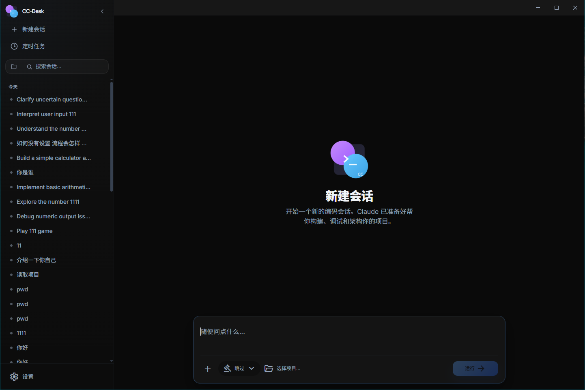
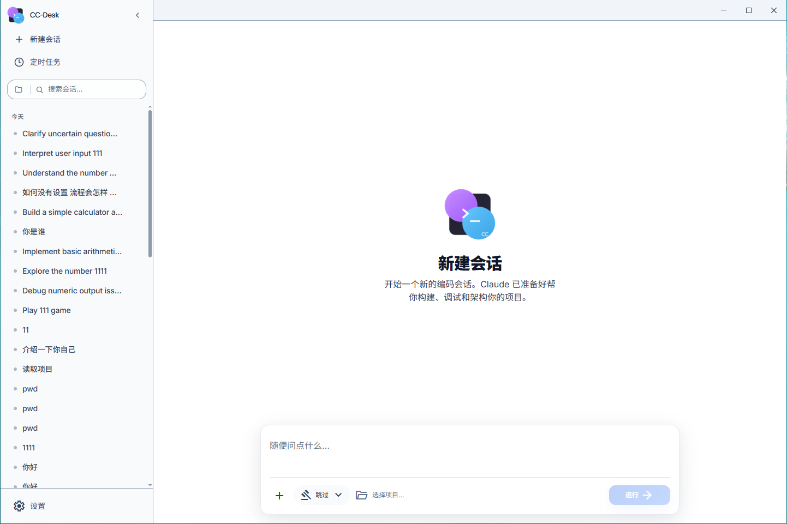

# CC-Desk

基于 [Claude-Code-Haha](https://github.com/NanmiCoder/cc-haha) 魔改的本地化 AI 编程助手桌面应用，支持接入任意 Anthropic 兼容 API（MiniMax、OpenRouter、DeepSeek 等）。

## 界面截图

## 功能概览

### 多模型支持
- 接入 Anthropic、OpenAI、OpenRouter、Ollama、Azure OpenAI、Google AI 等任意兼容 API
- 预设快速创建，支持 `anthropic` / `openai_chat` / `openai_responses` 多种 API 格式
- 四角色模型映射（main / haiku / sonnet / opus）

### 对话与编辑
- 流式 Markdown 渲染 + Shiki 语法高亮
- Diff 视图展示代码变更，词级别高亮
- 附件拖拽上传、粘贴图片、文件搜索（`@`）、斜杠命令（`/`）

### 权限控制
- 四种模式：询问权限 / 自动接受编辑 / 计划模式 / 绕过权限
- 发送框内一键切换

### 多会话与标签管理
- 多标签并行会话，拖拽排序
- 会话状态持久化，重启恢复
- 工作目录独立选择，Git 仓库自动识别

### Agent Teams
- 多代理协作可视化
- 团队成员状态监控（running / idle / completed / error）

### 定时任务
- Cron 表达式定时触发 AI 任务
- 运行历史记录，启用/禁用开关

### Computer Use
- 截屏、鼠标、键盘操作（Python Bridge 实现）
- 设置页查看环境状态、依赖安装

### IM 接入
- Telegram / 飞书机器人接入
- 远程对话、权限按钮、会话管理

### 其他
- 浅色/深色主题切换
- 中英文国际化
- Tauri 2 自动更新

## 修改说明

本项目基于 Claude-Code-Haha 0.1.7 版本，主要修改：

- 重写窗口 UI 皮肤（暖色调设计语言）
- 将 Claude-Code-Haha 全部替换为 CC-Desk
- 修复会话工作目录（workDir）的选择和传播问题
- 删除官方服务商卡片，改为本地 API 设置
- 删除设置页权限设置标签（与发送框权限选择器重复）
- 删除发送框按会话模型选择器（统一使用全局设置）
- 文件选择框移至发送栏权限选择器右侧

## 免责声明

本项目仅供学习和研究用途。
